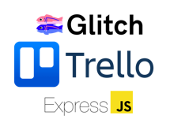

<a name="readme-top"></a>
<!-- PROJECT LOGO -->
<br />
<div align="center">
  <a href="https://mousemate.bme.gatech.edu">
    
  </a>

  <h3 align="center">Reverse-Chrono Trello Power-Up</h3>
</div>


<!-- ABOUT THE PROJECT -->
## About The Project

[![Power-up in action!][solution]][] - The power-up in action.

Mousemate was developed to streamline maintaining the records of a large mouse colony. Head to the Haider Wiki page to read more about the following:
* <a href="https://haiderwiki.bme.gatech.edu/index.php?title=Learn_Mousemate_Development">Development</a>
* <a href="https://haiderwiki.bme.gatech.edu/index.php?title=How_to_use_Mousemate">User Guide</a>


<p align="right">(<a href="#readme-top">back to top</a>)</p>


### Built With

* [![Node][Node.js]][Node-url] - The backend is a Node Express server.
* [![React][React.js]][React-url] - The frontend is a React application, started with create-react-app.
* [![MySQL][MySQL]][SQL-url] - Communication to a MySQL and MariaDB is done with Sequelize.


<p align="right">(<a href="#readme-top">back to top</a>)</p>


<!-- GETTING STARTED -->
## Getting Started

This is an example of how you may give instructions on setting up your project locally.
To get a local copy up and running follow these simple example steps.

### Prerequisites

This is an example of how to list things you need to use the software and how to install them.
* npm
  ```sh
  npm install 
  ```
* MySQL database (Workbench recommended)
* Web Server Hosting Service or localhost development server

### Installation

1. Clone the repo
   ```sh
   git clone https://github.gatech.edu/haider-lab/mousemate.git
   ```
3. Install NPM packages
   ```sh
   npm install
   ```
4. Enter your Databse Connection information in `app/config/db.config.js`
   ```js
      HOST: "Your SQL server IP Address or 127.0.0.1 for localhost",
      USER: "Username you created",
      PASSWORD: "Password you created",
      DB: "Database you created",
      dialect: "mysql"
   ```

<p align="right">(<a href="#readme-top">back to top</a>)</p>


<!-- USAGE EXAMPLES -->
## Usage

For examples, please refer to the [Documentation](https://haiderwiki.bme.gatech.edu/index.php?title=How_to_use_Mousemate).

<p align="right">(<a href="#readme-top">back to top</a>)</p>


<!-- ROADMAP -->
## Roadmap
- [x] Release prototype for testing
- [ ] Establish MVP
- [ ] Build Colony Reporting 
- [ ] Build User Guide


See the [open issues](https://github.gatech.edu/haider-lab/mousemate/issues) for a full list of proposed features (and known issues).

<p align="right">(<a href="#readme-top">back to top</a>)</p>


<!-- LICENSE -->
## License

Distributed under the MIT License. See `LICENSE.txt` for more information.

<p align="right">(<a href="#readme-top">back to top</a>)</p>


<!-- CONTACT -->
## Contact

Jason Sebek - jason.sebek@bme.gatech.edu

<p align="right">(<a href="#readme-top">back to top</a>)</p>


<!-- MARKDOWN LINKS & IMAGES -->
<!-- https://www.markdownguide.org/basic-syntax/#reference-style-links -->

[product-screenshot]: ./images/screenshot.png
[checklist-problem]: ./images/checklist_bottom.gif
[scroll-problem]: ./images/tricky_scroll.gif
[solution]: ./images/sorted.gif

[Node.js]: https://img.shields.io/badge/Node.js-43853D?style=for-the-badge&logo=node.js&logoColor=white
[Node-url]: https://nodejs.org/en
[React.js]: https://img.shields.io/badge/React-20232A?style=for-the-badge&logo=react&logoColor=61DAFB
[React-url]: https://reactjs.org/
[MySQL]: https://img.shields.io/badge/MySQL-00000F?style=for-the-badge&logo=mysql&logoColor=white
[SQL-url]: https://www.mysql.com/